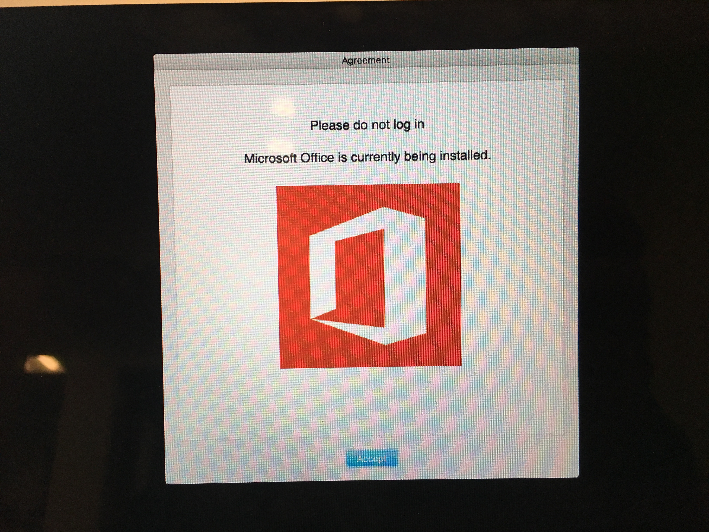
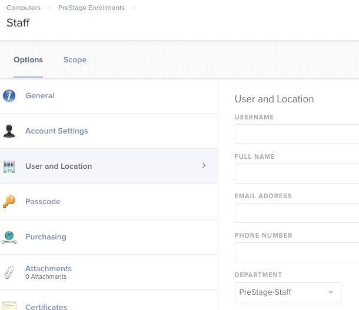
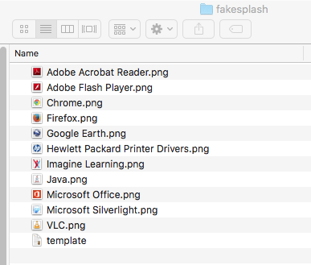
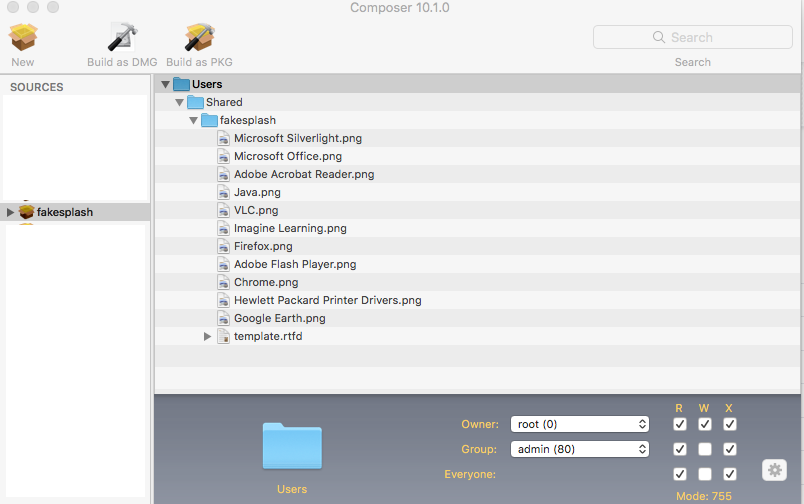
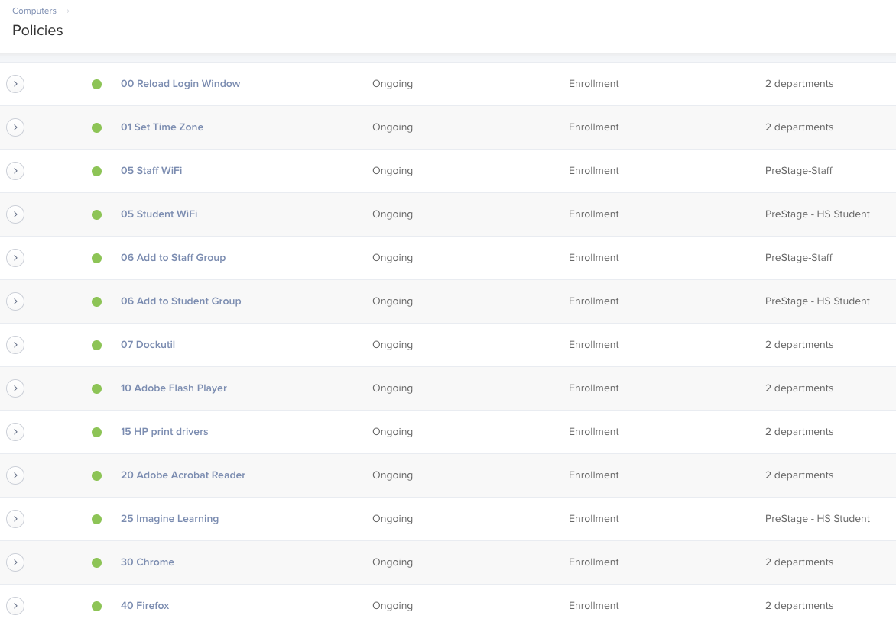

# fakeSplash
see what's going on with your enrollment policies before logging in for the first time

fakeSplash is an attempt to display what's happening with your enrollment triggered jamf policies before logging in to your computer. It is similar to splashbuddy and other apps of that nature. This would be useful in a lab environment where you want to see the progress of your initial setup. This is accomplished by modifying the policy banner.

## Example

## Setup
- Set up a prestage enrollment policy 
  - If all of your computers will receive the same setup, there is no need to differentiate. We use several different configurations, so we need a way to differentiate which policies will get applied to which configs. I use the department field for this. How you handle this is up to you. 
- Create folder "fakesplash" in /Users/Shared
- Place template.rtfd file into the fakesplash folder
- Place images to be displayed into the fakesplash folder. Name the image the name of the application or policy. 
- Using Composer, create a .dmg of /Users/Shared/fakesplash and upload to your JSS 
- Upload the script "setAppLoadingMessage" to your JSS 
  - set priority to before
- Upload the script "buildBanner" to your JSS and set priority to before
  - Set priority to before
  - Set parameter label for parameter 4 to "App Name" 
- Policy Creation
  - I number policies because they are executed in alphabetical order
  - I scope the policies to departments set in the prestage enrollment
  - All policies are triggered by Enrollment Complete and have a frequency of Ongoing
- First Policy
  - named to "00 Reload Login Window" so it executes first
  - Installs the fakesplash.dmg that you created with composer
  - Run the script setAppLoadingMessage 
    - This sets our initial policy banner as soon as possible
- Other Policies
  - Used to install apps, whatever else you want to do to a new computer
  - Name with number in order of what you want to run 
    - alphabetical order, so policy 125 runs before policy 20
  - Policies triggered by Enrollment Complete and execution frequency of Ongoing
  - Package for whatever software you are installing
  - Under Scripts, run the buildBanner script
    - Set to execute Before
    - The parameter given under App Name must match the image you put in the fakesplash folder
      - This name will also be used in the banner
    - If this script is not set for a policy, the banner from the previous policy will remain on the screen while the current policy is run
- Final Policy
  - Name the policy "999 Reboot"
  - Triggered by enrollment complete and ongoing frequency
  - Under maintenance, update inventory
  - Under files and processes, execute command "rm -rf /Library/Security/PolicyBanner.rtfd||exit"
  - Under Restart Options select restart immediately
Your policies will look something like this 

We have a script run once per computer at login that prompts for a computer name to rename the computer. Once the computer has rebooted, someone logs in locally to set the computer name. After that, configuration is complete.
